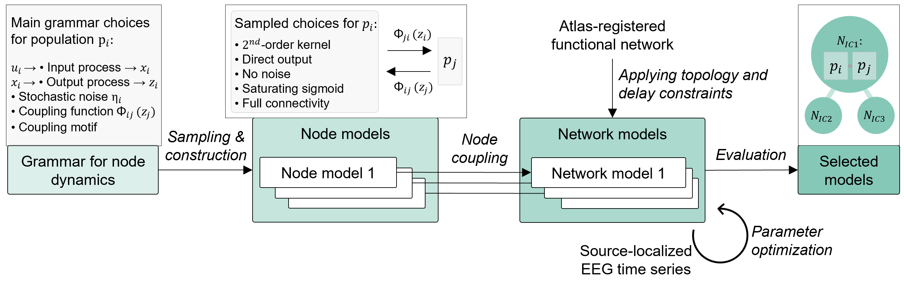

# ENEEGMA

**ENEEGMA - Exploring Neural EEG Model Architectures - is a Julia package for constructing, simulating, and optimizing networks of neural population models.**

[](https://opensource.org/licenses/MIT)
[](https://julialang.org/)

## Overview



It enables:

1. **Grammar-based model generation**: Generate diverse single population models from formal grammar
2. **Network construction**: Build multi-node networks with flexible connectivity
3. **Efficient simulation**: Solve coupled stochastic or deterministic differential equations
4. **Parameter optimization**: Fit network parameters to empirical EEG data using state-of-the-art optimizers

## Installation

```julia
# Add to your Julia environment
using Pkg
Pkg.add(url="https://github.com/NinaOmejc/ENEEGMA.git")

# Or development mode
Pkg.develop(url="https://github.com/NinaOmejc/ENEEGMA.git")
```

## Examples

Three working examples demonstrate the full workflow:

### Example 1: Settings Configuration
```bash
julia examples/example1_settings.jl
```
Learn how to create, customize, and save settings with sensible defaults.

### Example 2: Grammar Sampling & Simulation
```bash
julia examples/example2_sampling_simulation.jl
```
Build a network and run simulations with multiple random initializations.

### Example 3: Parameter Optimization
```bash
julia examples/example3_optimization.jl
```
Configure and understand the parameter optimization workflow.


## Related paper

If you use ENEEGMA in your research, please cite:

```bibtex
to add
```

## License

MIT License - see [LICENSE](LICENSE) file for details


